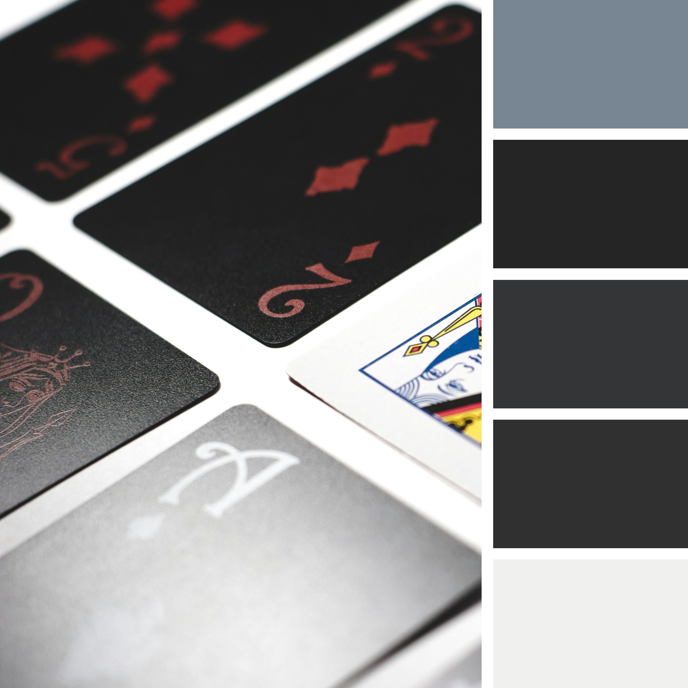
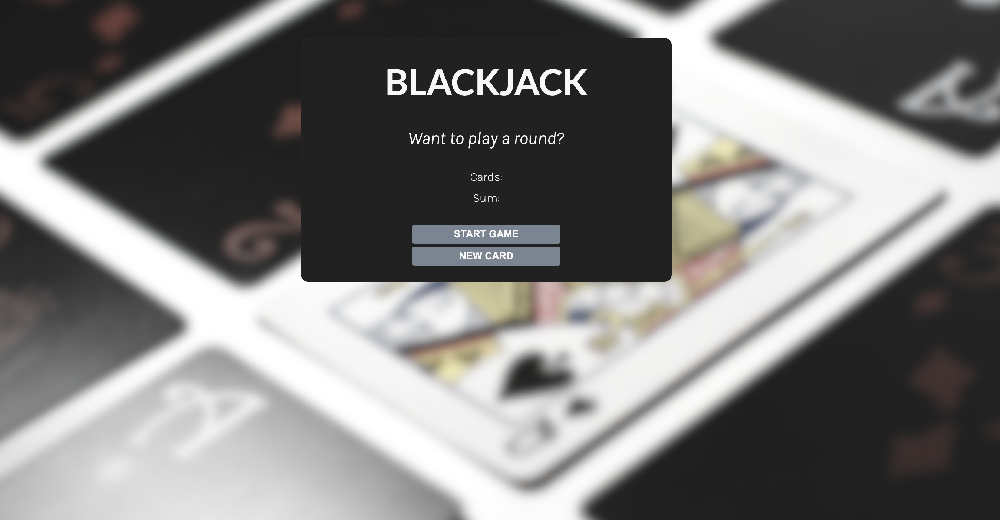

# Blackjack Game

This project is a simple Blackjack game created as part of the Scrimba Frontend Developer Path. It allows users to enjoy a classic game of Blackjack directly from their web browser, featuring a stylish and user-friendly interface tailored to enhance the gaming experience.

## Table of Contents

- [Features](#features)
- [Design and Style](#design-and-style)
- [Usage](#usage)
- [Credits](#credits)
- [License](#license)
- [Questions](#questions)

## Features

- **Card Drawing**: Start the game or draw a new card to try reaching the magic number, 21.
- **Interactive Gameplay**: Interact directly through buttons to manage your gameplay.
- **Responsive Design**: Play on any device, the game adjusts to fit your screen size perfectly.

## Design and Style

The game's visual style and layout are crafted using background images sourced from Unsplash, with overlays and edits made through Canva. The colors were handpicked using Coloors to ensure aesthetic pleasure and readability. The CSS and HTML structure is designed to be both functional and visually appealing, promoting an enjoyable user experience.

## Usage

To play the Blackjack game:

1. Visit the hosted version [here](https://adriannaderkacz.github.io/blackjack/) to play directly in your browser.
2. Click on the "START GAME" button to deal the initial cards.
3. Use the "NEW CARD" button to draw additional cards as needed.
4. The game automatically checks if your card sum matches, exceeds, or is below 21.

The game is straightforward and does not require any installation, as it can be run directly from a browser.

## Credits

- **Background Image:** Sourced from [Unsplash](https://unsplash.com/photos/queen-of-spade-playing-card-OfdFHy1zxjQ).
- **Design Tools:** Styled using [Canva](https://canva.com) and [Coloors](https://coolors.co).
- **Project Guidance:** [Scrimba Frontend Developer Path](https://scrimba.com/learn/frontend).

## License

MIT License

Copyright (c) [2024] [Your Name]

Permission is hereby granted, free of charge, to any person obtaining a copy of this software and associated documentation files (the "Software"), to deal in the Software without restriction, including without limitation the rights to use, copy, modify, merge, publish, distribute, sublicense, and/or sell copies of the Software, and to permit persons to whom the Software is furnished to do so, subject to the following conditions:

The above copyright notice and this permission notice shall be included in all copies or substantial portions of the Software.

THE SOFTWARE IS PROVIDED "AS IS", WITHOUT WARRANTY OF ANY KIND, EXPRESS OR IMPLIED, INCLUDING BUT NOT LIMITED TO THE WARRANTIES OF MERCHANTABILITY, FITNESS FOR A PARTICULAR PURPOSE AND NONINFRINGEMENT. IN NO EVENT SHALL THE AUTHORS OR COPYRIGHT HOLDERS BE LIABLE FOR ANY CLAIM, DAMAGES OR OTHER LIABILITY, WHETHER IN AN ACTION OF CONTRACT, TORT OR OTHERWISE, ARISING FROM, OUT OF OR IN CONNECTION WITH THE SOFTWARE OR THE USE OR OTHER DEALINGS IN THE SOFTWARE.

## Questions

For questions, please contact me at your.email@gmail.com.
GitHub: [yourgithubprofile](https://github.com/yourgithubprofile).